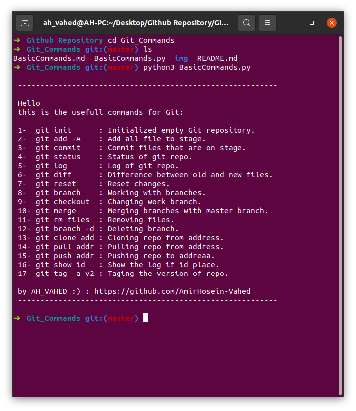

# [Git Commands](https://github.com/AmirHosein-Vahed/Git_Commands)
-----------------------------------------------------------------------------
#### * This repo is for whom want to _start_ with git :)
#### * Knowledge is accessible from everywhere :)
------------------------------------------------------------------------------
### to run BasicCommands.py
#### First: clone my repository:
`git clone https://github.com/AmirHosein-Vahed/Git_Commands.git`
#### Second: if you havn't [python3](https://www.python.org/) first install it
#### Third: start terminal _in linux_ or cmd _in windows_ and then go to directory that you clone my repo and type:
`python3 BasicCommands.py`

